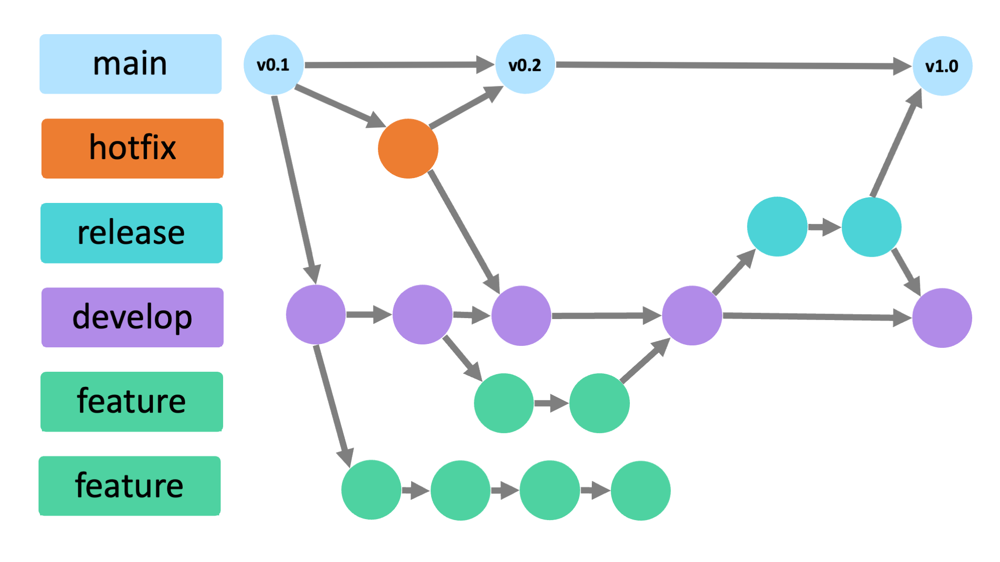

[< к содержанию](./readme.md) | [далее >](./installation.md)

## Что такое Git?

**Git** - это консольная утилита для отслеживания и ведения истории изменения файлов в вашем проекте. Чаще всего его используют для кода, но можно и для других типов файлов.

С помощью Git вы можете откатить свой проект до более старой версии, сравнивать, анализировать или сливать свои изменения в *репозиторий*.

Репозиторием называют хранилище вашего кода и историю его изменений. Git работает локально и все ваши репозитории хранятся в определенных папках на жестком диске.

Также ваши репозитории можно хранить удаленно, для этого обычно используются различные IT-хостинги. Среди Git-хостингов наибольшей популярностью пользуются три сервиса:

* [*GitHub*](https://github.com/)
* [*Bitbucket*](https://bitbucket.org/)
* [*GitLab*](https://about.gitlab.com/)

Каждая точка сохранения вашего проекта носит название *коммит* (commit). У каждого коммита есть hash (уникальная метка) и комментарий. Из таких коммитов собирается *ветка* (branch). 

Ветка - это история изменений. У каждой ветки есть свое название. Репозиторий может содержать в себе несколько веток, которые создаются из других веток или вливаются в них.

*Рисунок 1. Модель ветвления Gitflow, предложенная Винсентом Дриссеном в 2010 году.*